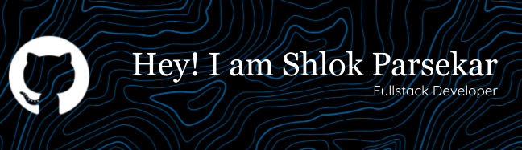

---

## 📌 **About Me**

- ### 🎓 Pursuing **B.E. in Information Technology** at **Padre Conceição College of Engineering** (2022–Present)  
- ### 💡 Passionate about **AI/ML**, **Web & App Dev**, **Software Development**, and **Problem Solving**  
- ### 🔍 Currently exploring **Full-Stack Development**, **Cloud Computing**, and **Machine Learning**  
- ### 🤝 Always open to **collaborations**, **team projects**, and **learning new technologies**

---

## 🚀 **Technical Skills**

### Programming Languages  

   &nbsp;&nbsp;
   &nbsp;&nbsp;
   &nbsp;&nbsp;
   &nbsp;&nbsp;
   &nbsp;&nbsp;
  

### Web Technologies  

   &nbsp;&nbsp;
  

### Version Control & Collaboration  

   &nbsp;&nbsp;
  

### Databases  

   &nbsp;&nbsp;
  

### Tools & IDEs  

   &nbsp;&nbsp;
   &nbsp;&nbsp;
  

---

## 📊 **GitHub Stats**

    
  

---

## 🌐 **Let's Connect!**

- ### LinkedIn: [linkedin.com/in/shlokparsekar](https://www.linkedin.com/in/shlok-parsekar/)
- ### Email: [shlokrparsekarwork@gmail.com](mailto:shlokrparsekarwork@gmail.com)

---

_"Code. Create. Collaborate. Contribute."_
